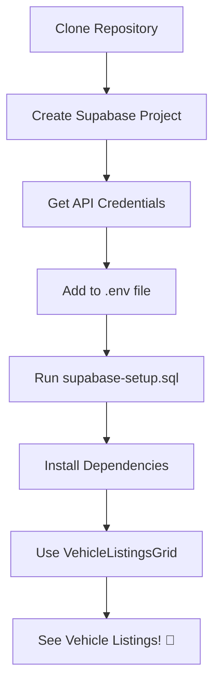

# 📁 Project Structure - Supabase Integration

## Overview

```
components-pkg/
├── 📄 Configuration & Setup
│   ├── .env                      # ⚠️ ADD YOUR CREDENTIALS HERE
│   ├── .env.example              # Template for .env
│   ├── supabase-setup.sql        # Database schema (run in Supabase)
│   └── .gitignore                # Updated to exclude .env
│
├── 📚 Documentation
│   ├── README.md                 # Main documentation (updated)
│   ├── QUICK_START.md            # Quick reference guide
│   ├── SUPABASE_SETUP.md         # Detailed setup instructions
│   ├── INTEGRATION_SUMMARY.md    # What was created
│   └── PROJECT_STRUCTURE.md      # This file
│
├── 💡 Examples
│   ├── basic-usage.tsx           # Simple usage example
│   ├── with-filters.tsx          # Advanced filtering example
│   └── README.md                 # Examples documentation
│
└── 🔧 Source Code
    ├── src/
    │   ├── lib/
    │   │   ├── supabase/
    │   │   │   ├── client.ts          # Supabase client setup
    │   │   │   ├── types.ts           # TypeScript types
    │   │   │   ├── vehicleService.ts  # Database service layer
    │   │   │   └── index.ts           # Exports
    │   │   └── index.ts               # Updated with supabase exports
    │   │
    │   ├── hooks/
    │   │   ├── useVehicleListings.ts  # Vehicle data hooks
    │   │   └── index.ts               # Updated with new exports
    │   │
    │   └── components/
    │       ├── vehicleListings/
    │       │   ├── VehicleListingsGrid.tsx  # Main grid component
    │       │   ├── index.tsx                # Component exports
    │       │   └── index.stories.tsx        # Storybook stories
    │       └── index.ts                     # Updated with new exports
    │
    └── package.json                   # Updated with dependencies
```

## 📦 Key Directories

### `/` (Root)
Configuration files and documentation for the Supabase integration.

**Action Required:**
- Edit `.env` with your Supabase credentials
- Run `supabase-setup.sql` in Supabase SQL Editor

### `/examples`
Ready-to-use example implementations.

**Files:**
- `basic-usage.tsx` - Minimal setup, perfect for getting started
- `with-filters.tsx` - Full-featured with search and filters
- `README.md` - How to use the examples

### `/src/lib/supabase`
Core Supabase integration layer.

**Files:**
- `client.ts` - Configured Supabase client instance
- `types.ts` - TypeScript interfaces for vehicles
- `vehicleService.ts` - Methods for database operations
- `index.ts` - Public exports

**Usage:**
```tsx
import { supabase, VehicleService } from '@smg-automotive/components/lib/supabase';
```

### `/src/hooks`
React hooks for working with vehicle data.

**New Hooks:**
- `useVehicleListings()` - Fetch listings with pagination
- `useVehicleListing(id)` - Fetch single listing
- `useVehicleSearch(term)` - Search listings

**Usage:**
```tsx
import { useVehicleListings } from '@smg-automotive/components';
```

### `/src/components/vehicleListings`
React components for displaying vehicle listings.

**Components:**
- `VehicleListingsGrid` - Main grid component with loading/error states

**Usage:**
```tsx
import { VehicleListingsGrid } from '@smg-automotive/components';
```

## 🔄 Data Flow

```
User Component
      ↓
VehicleListingsGrid
      ↓
useVehicleListings Hook
      ↓
VehicleService
      ↓
Supabase Client
      ↓
Supabase Database
```

## 🎯 Import Paths

### Components
```tsx
import { 
  VehicleListingsGrid,
  ThemeProvider 
} from '@smg-automotive/components';
```

### Hooks
```tsx
import { 
  useVehicleListings,
  useVehicleListing,
  useVehicleSearch 
} from '@smg-automotive/components';
```

### Supabase Client & Service
```tsx
import { 
  supabase,
  VehicleService,
  VehicleListing,
  VehicleFilters 
} from '@smg-automotive/components/lib/supabase';
```

## 📊 Database Structure

```sql
vehicle_listings
├── id (UUID, Primary Key)
├── created_at (Timestamp)
├── updated_at (Timestamp)
│
├── Vehicle Info
│   ├── make
│   ├── model
│   ├── year
│   ├── price
│   ├── mileage
│   ├── title
│   ├── description
│   ├── vin
│   ├── color
│   ├── fuel_type
│   ├── transmission
│   └── body_type
│
├── Images
│   ├── image_url
│   └── images (array)
│
├── Seller Info
│   ├── seller_name
│   ├── seller_address
│   ├── seller_phone
│   └── seller_email
│
├── Location
│   ├── location_city
│   ├── location_country
│   └── location_zip
│
└── Metadata
    ├── status
    ├── features (array)
    ├── views
    └── is_featured
```

## 🚀 Getting Started Flow



## 📝 Files You Need to Touch

### Must Edit
1. `.env` - Add your Supabase credentials

### Must Run
1. `supabase-setup.sql` - In Supabase SQL Editor

### Can Customize
1. `src/lib/supabase/types.ts` - Modify vehicle schema
2. `src/components/vehicleListings/VehicleListingsGrid.tsx` - Customize UI
3. Examples - Adapt to your needs

### Don't Touch (Unless You Know What You're Doing)
1. `.gitignore` - Properly configured
2. `src/lib/supabase/client.ts` - Works as-is
3. `src/lib/supabase/vehicleService.ts` - Tested and ready

## 🎨 Customization Points

### Easy
- Grid columns layout
- Filter options
- Styling with Chakra UI props

### Medium
- Add new filters
- Customize vehicle card layout
- Add sorting options

### Advanced
- Extend database schema
- Add authentication
- Implement image uploads
- Real-time updates

## 📚 Documentation Hierarchy

```
Start Here
    ↓
QUICK_START.md (5 min read)
    ↓
SUPABASE_SETUP.md (Detailed steps)
    ↓
examples/README.md (Implementation)
    ↓
README.md (Full API reference)
    ↓
Source Code (Deep dive)
```

## 🔍 Finding What You Need

**"I want to get started quickly"**
→ Read `QUICK_START.md`

**"I need detailed Supabase setup"**
→ Read `SUPABASE_SETUP.md`

**"I want to see examples"**
→ Check `/examples` directory

**"How do I use the components?"**
→ Check `README.md` Supabase section

**"What files were created?"**
→ Read `INTEGRATION_SUMMARY.md`

**"How is the project organized?"**
→ Read `PROJECT_STRUCTURE.md` (this file)

**"I want to customize something"**
→ Look in `/src/lib/supabase` or `/src/components/vehicleListings`

## ✅ Checklist

- [ ] `.env` file has credentials
- [ ] `supabase-setup.sql` has been run
- [ ] Dependencies installed (`npm install`)
- [ ] Can import components
- [ ] Storybook works (`npm run dev`)
- [ ] Understand basic usage

---

**Ready to build?** Start with `QUICK_START.md`! 🚀
